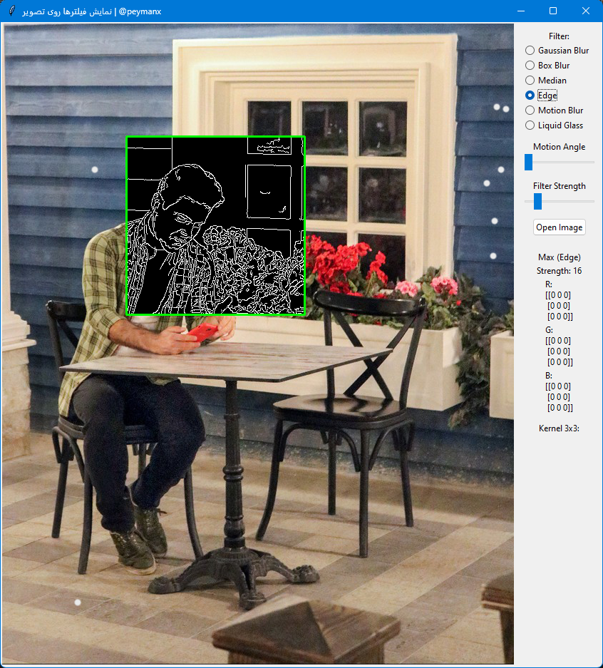

# How Filters Work

This project provides a graphical user interface (GUI) for applying various image filters and effects to images. It includes features such as Gaussian blur, box blur, edge detection, motion blur, and a unique "liquid glass" effect.


## Features

- **Interactive GUI**: Built using `Tkinter` for real-time image manipulation.
- **Filter Options**:
  - Gaussian Blur
  - Box Blur
  - Median Blur
  - Edge Detection
  - Motion Blur
  - Liquid Glass Effect
- **Customizable Parameters**:
  - Filter strength
  - Motion blur angle
  - Adjustable box size for region selection
- **Real-time Preview**: Apply effects interactively by moving the mouse over the image.



## Installation

1. Clone the repository:
   ```bash
   git clone https://github.com/peymanx/blur-filter-app.git
   cd blur-filter-app